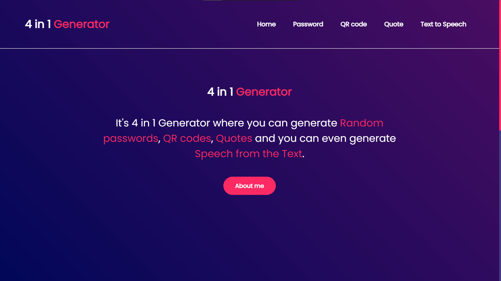
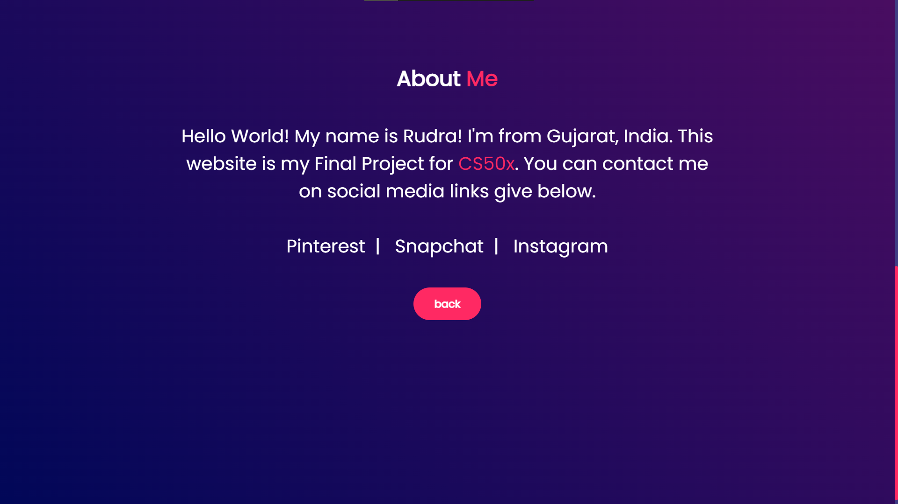
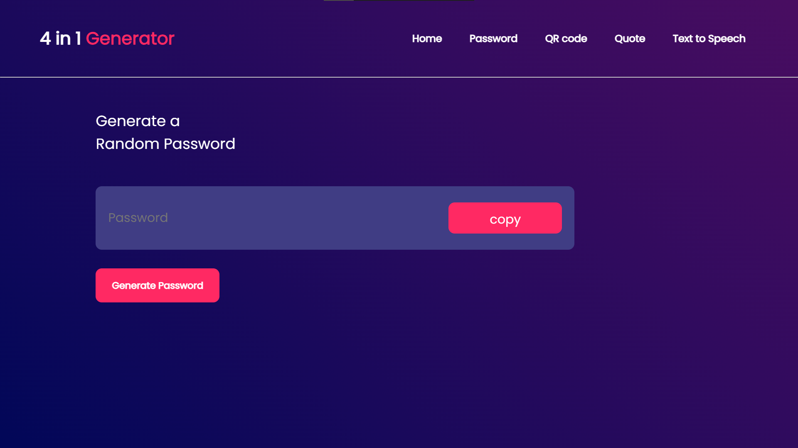
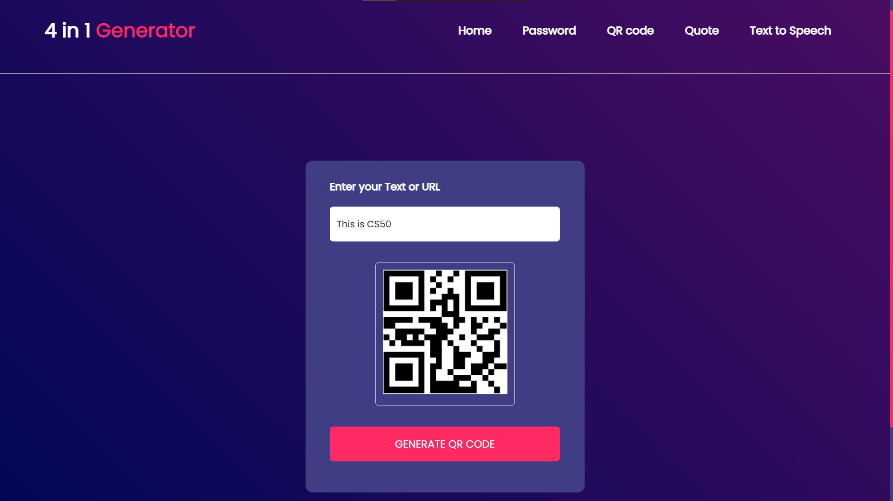
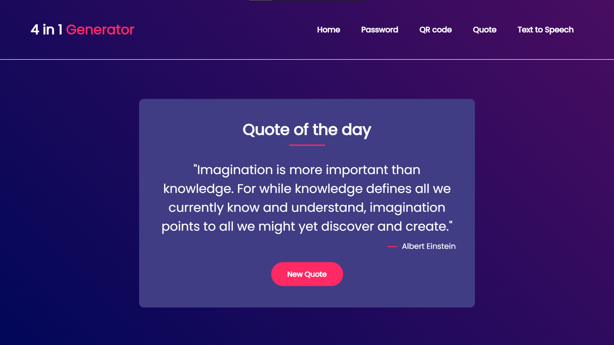
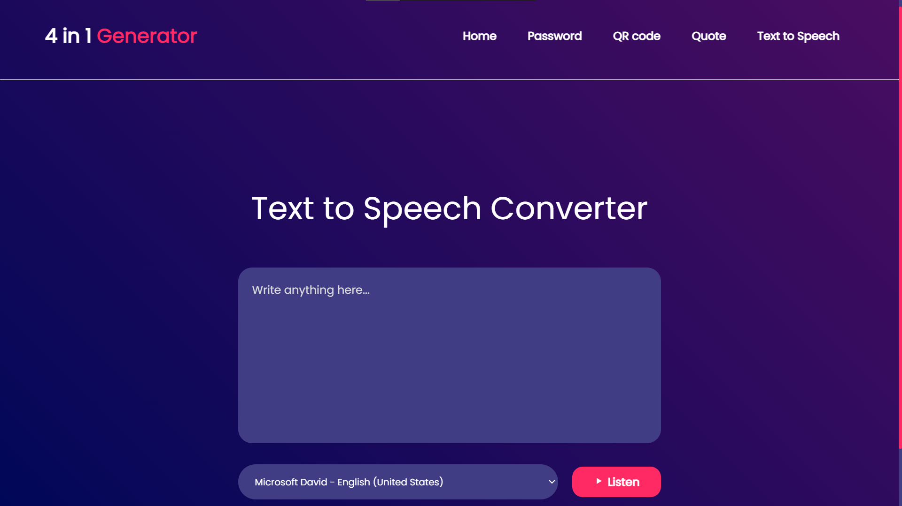

# 4 in 1 Generator


## CS50

>This is the final project to conclude the CS50 Introduction to Computer Science course.

>CS, web development, HTML, CSS, JS, CS50


## Explaining the project

This final project is a website that helps to generate:

* Random Passwords
* QR codes
* Quotes
* Speech from the Text

This website uses different APIs to generate items given above.

The website contains in total 5 pages that includes all the generators mentioned above plus a homepage.


### Home Page

---

Homepage uses HTML and CSS for functioning. The homepage is divided into 3 sections
using ```<div>``` tag. The three sections are:

1. Navigation bar
2. About website
3. About me

#### 1. Navigation bar

Navigation bar contains 1 logo (which is simple ```<h2>``` tag) and five ```<a>``` tags that navigates you to the different generators and back to home page

To separate "Navigation bar" section from "About website" section, ```<hr>``` is used for visual appeal.

#### 2. About website

About website contains simple lines of text that explains the functioning of the website. The use of ```<a>``` tags enables the user to jump on different generators by simply clicking on the respective text.

There is "About me" button at end of the About website text. Clicking on it helps to scroll down on to the About me section smoothly.

#### 3. About me

This section is similar to the About website section. It contains my name, city, country and my motive for making this website.

There are links to my social media handles.

After all that there is button called "Back". When you click on the button it will scroll you up to the top of the website.


### Password Generator

---

Password Generator utilises simple HTML, CSS and JavaScript to perform its job. There is ```button``` which says "Generate Password". When you click on it, there will be a random password on the ```input``` box given right above the ```button```. Since I've used ```<input>``` tag for the box, you can make changes in generated password.

There is also a ```button``` named "copy". When you click on it, the generated password will be selected and will be copied to the clip board.

#### Key features of the Password Generator:

1. Length of the password: 12 characters.
1. There will always be an upper case latter.
2. There will always be a lower case latter.
3. There will always be a number.
4. There will always be 1 special character.


### QR code Generator

---

QR code Generator uses HTML, CSS and JavaScript to generate QR code according to provided Text or URL. This page uses [Go QR API](https://goqr.me/api/).

There is input box in the centre which says "Text or URL". You need to put your text/URL there. If you don't put anything there it'll not generate any QR code. 

After putting your text/URL into the text box you need to click the ```button``` that says "GENERATE QR CODE". After clicking on it a QR code will appear and scanning on that code leads you the provided Text or the URL. To save the QR code you can right click on QR code and click "save image as...".


### Quote Generator

---

Quote Generator uses HTML, CSS and JavaScript to generate new Quote every time you reload or revisit this page. It also provides author's name. To do that is uses [Quotable API](https://github.com/lukePeavey/quotable).

This page contains a box that says "Quote of the day" and under that it'll generate new quote every time you visit website.

To generate new quote without reloading the website you can click on ```button``` given below that says "New Quote".


### Text to Speech Generator

---

Text to Speech Generator uses HTML, CSS and JavaScript to convert Text into the Speech. You need to add your text into the text box that says "Write anything here..."

To convert given text into the speech it uses ```speechSynthesis``` properties in JavaScript.

There is drop down menu right under the text box. There you can choose what type of voice you want.

To listen to the generated speech you can simply click on the button right after drop down menu that says "Listen".

## Pictures

* Home Page



* About me



* Password Generator



* QR code Generator



* Quote Generator



* Text to Speech 




## Demonstration on youtube

[My final project presentation](#)

## APIs used

* [Go QR API](https://goqr.me/api/)
* [Quotable API](https://github.com/lukePeavey/quotable).


## About CS50

CS50 is an open ware course from Harvard University and taught by David J. Malan

Introduction to the intellectual enterprises of computer science and the art of programming. This course teaches students how to think algorithmically and solve problems efficiently. Topics include abstraction, algorithms, data structures, encapsulation, resource management, security, and software engineering. Languages include C, Python, and SQL plus students’ choice of: HTML, CSS, and JavaScript (for web development).

Thank you for all CS50.

- Where I get CS50 course?
https://cs50.harvard.edu/x/2023/
